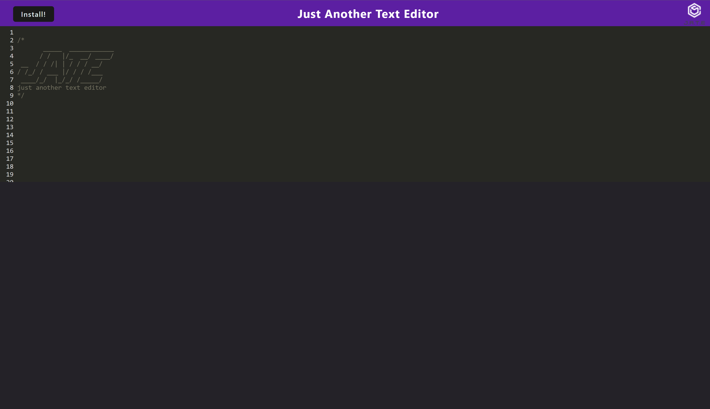
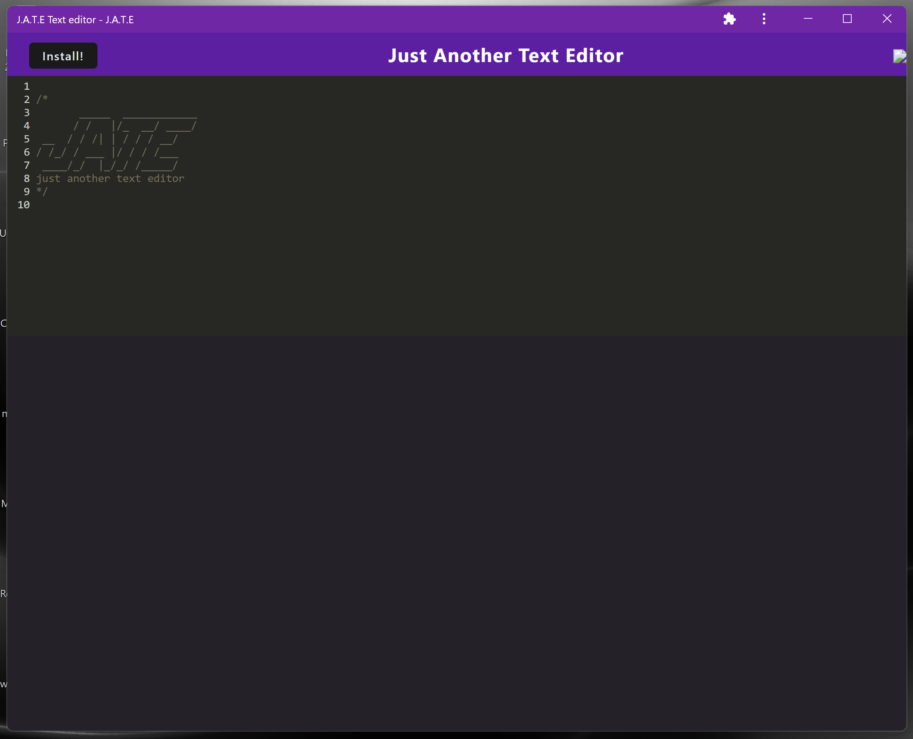

# Text Editor

A simple text editor that is a progressive web application(PWA) and is downloadable to your PC for offline use. Created with the help of Webpack and some plugins.

Here is the deployed link: <a href="https://mighty-hamlet-21113.herokuapp.com/">Text Editor</a>

This is how it looks when it is run on the browser:

 

 

This is the desktop installed version:

 

## Table of Contents 📖

* [ Installation -⚡️](#installation)
* [ Technologies -🔧](#technologies)
* [ Contributors -🙌](#contributors)
* [ License ](#license)

 

## Installation ⚡️

Clone the repository if you wish to run it on your local machine. Navigate to the root directory and install the required packages by entering the following command in your terminal:  `npm i`

 

## Technologies 🔧

* Node
* Express
* Webpack
* PWA
* JavaScript

 

## Contributors 🙌

* **Mohammad Razvi** - [LinkedIn](https://www.linkedin.com/in/mohammad-razvi/)

 

## License

